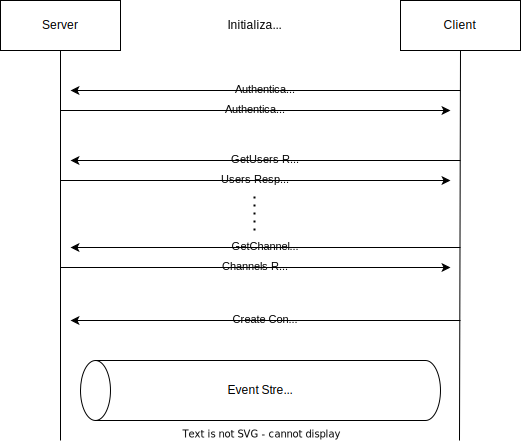
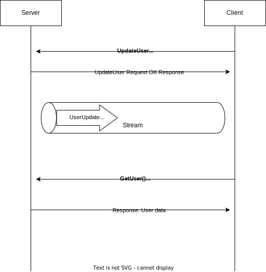

# RPC接続概要

## RPCの初期接続の説明

クライアントの初期起動時はデータを持っていないため、サーバからデータを取得する必要がある。
まず、データを取得する前にそのクライアントが適切なユーザであるかを確認するために認証・認可を行います。  
検証後、それに伴ったデータを取得します。
最後にイベントストリームとしてサーバサイドストリームをリクエストし、RPCの初期設定を完了させます。

フローチャートの例では、Authenticationリクエストにより認証・認可を行います。
その後、適切な権限でUsersやChannelなどのデータを取得します。
最後にサーバサイドストリームを作成し、初期接続を終了します。

以下はクライアントの初期起動の際に接続を行う時のリクエストレスポンス図です。

### 基本的なRPC接続の説明

あるクライアントはUpdateUser関数や何かしらのサーバのデータを変更させる処理を送ると、サーバはサーバサイドストリームを張っている全てのクライアントに対してイベントを送ります。  
クライアントはUserUpdatedイベントを受け取ると、そのイベントにあったGetリクエストで
変更されたデータをサーバから取得します。

フローチャートの例では、UpdateUser関数でユーザデータがアップデートされたので、全てのクライアントにUserUpdatedイベントをサーバサイドストリーム内で送ります。  
UserUpdatedイベントでユーザデータがアップデートされたのをクライアントが知ったので、サーバに対して変更が行われたユーザデータを取得するためにGetUser関数でユーザデータを取得し、自分のクライアントに反映します。

以下はクライアントの基本的な変更操作の接続を行う時のリクエストレスポンス図です。

